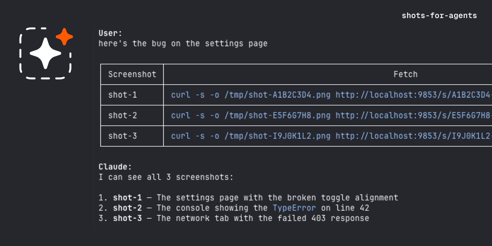

# Shots for Agents



A Mac menu bar utility that turns screenshots into one-time localhost URLs you can paste into AI agents.

## The Problem

Working with AI agents means taking a lot of screenshots — sharing UI bugs, showing designs, pointing at errors on screen. Every one of those screenshots lands on your desktop or downloads folder and stays there forever. You end up with hundreds of temp screenshots that were only ever meant to be seen once by an AI.

macOS has no concept of a "temporary screenshot." Every capture is permanent until you manually clean it up.

## How It Works

Shots for Agents sits in your menu bar. Press a shortcut, select a region, and get a curl command on your clipboard. Curl instead of a URL because AI agents can't fetch localhost with their web tools, but they can run shell commands.

### Single Screenshot

```
⌃⇧S → Select Region → curl command copied → Paste into agent → Agent reads it → Gone. 410.
```

**Clipboard result:**
```
curl -s -o /tmp/shot-A1B2C3D4.png http://localhost:9853/s/A1B2C3D4-...-E5F6.png
```

**What the agent does:**
```bash
$ curl -s -o /tmp/shot-A1B2C3D4.png http://localhost:9853/s/A1B2C3D4-...-E5F6.png
$ # Reads /tmp/shot-A1B2C3D4.png → sees your screenshot

$ curl -s http://localhost:9853/s/A1B2C3D4-...-E5F6.png
> Gone  (HTTP 410)
```

### Multiple Screenshots

Keep pressing the shortcut — each capture adds to a batch. The clipboard updates with a markdown table after every capture:

| Screenshot | Fetch |
|------------|-------|
| shot-1 | `curl -s -o /tmp/shot-A1B2C3D4.png http://localhost:9853/s/...` |
| shot-2 | `curl -s -o /tmp/shot-E5F6G7H8.png http://localhost:9853/s/...` |
| shot-3 | `curl -s -o /tmp/shot-I9J0K1L2.png http://localhost:9853/s/...` |

Paste the table into your agent and it fetches all screenshots at once. The batch auto-clears after 30 seconds of inactivity, or clear it from the menu bar.

### Expiry

- After the agent reads a screenshot, it stays available for **60 seconds** (configurable), then deletes.
- Unread screenshots expire after **10 minutes** (configurable).
- Nothing is ever written to disk. When the app quits, everything is gone.

## Install

Requires Xcode 16+ and macOS 14 (Sonoma) or later.

```bash
git clone https://github.com/Kalypsokichu-code/shots-for-agents.git
cd shots-for-agents
open ShotsForAgents.xcodeproj
```

Build and run from Xcode (`Cmd+R`). First launch will ask for **Screen Recording** permission — grant it in System Settings.

If you modify `project.yml`, regenerate the Xcode project with:

```bash
brew install xcodegen  # if not installed
xcodegen generate
```

## Settings

Click the menu bar icon → **Settings** to configure:

| Setting | Default | Description |
|---|---|---|
| Capture shortcut | `Ctrl+Shift+S` | Global hotkey to trigger capture |
| Port | `9853` | Localhost port for the image server (restart to apply) |
| Unread expire | `10 min` | How long unread screenshots stay in memory |
| Keep after read | `60 sec` | How long screenshots persist after first fetch |
| Launch at login | Off | Start automatically on login |

## Architecture

- **ScreenCaptureKit** — Captures the display. Freeze-and-select: captures the full screen, shows it as a frozen overlay, user drags to select a region.
- **FlyingFox** — Lightweight async Swift HTTP server. Serves screenshots on localhost.
- **KeyboardShortcuts** — Global hotkey registration without requiring Accessibility permissions.
- **In-memory store** — Screenshots are never written to disk. An actor-based store handles concurrent access.

Only permission required is **Screen Recording**.

## Dependencies

| Package | Purpose |
|---|---|
| [FlyingFox](https://github.com/swhitty/FlyingFox) | Async HTTP server |
| [KeyboardShortcuts](https://github.com/sindresorhus/KeyboardShortcuts) | Global hotkey |

## License

MIT
